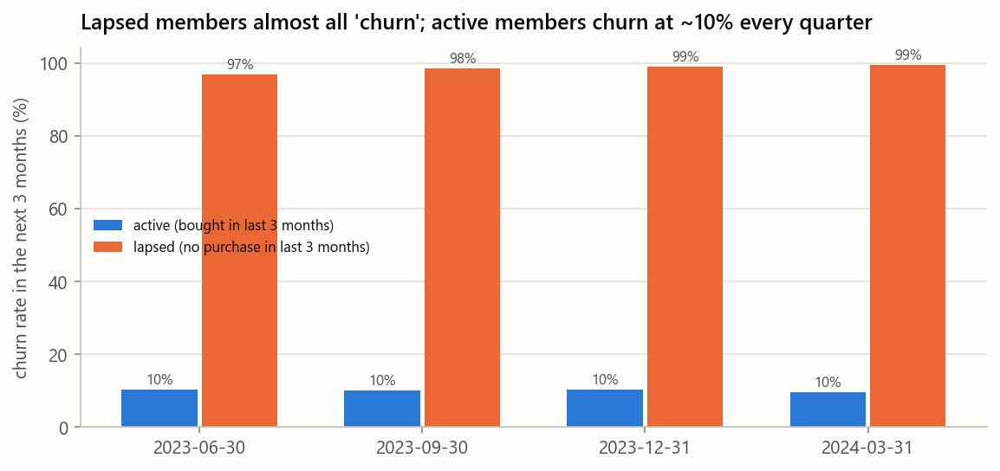
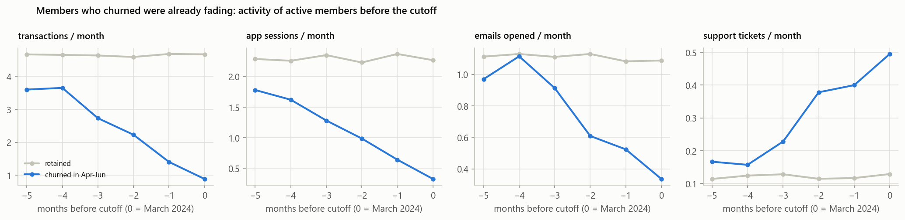
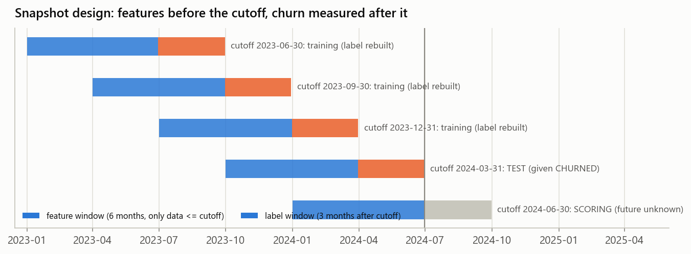
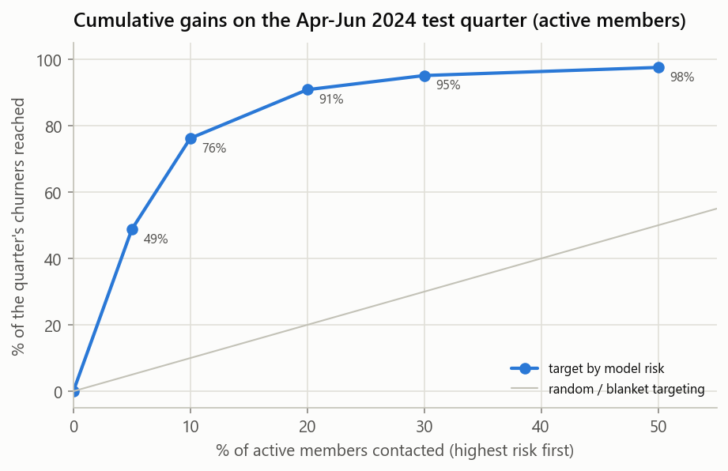
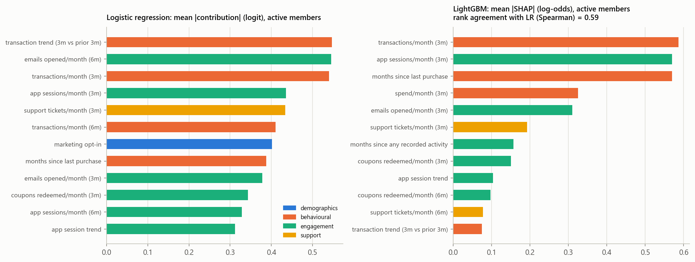
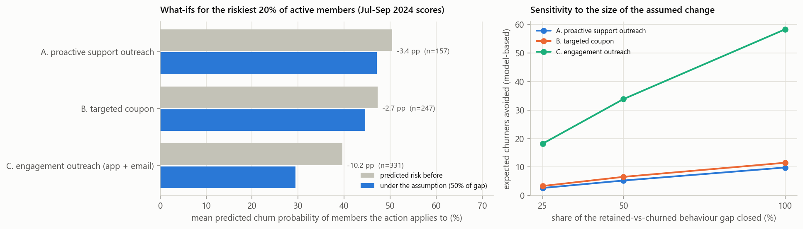

# Loyalty-member churn prediction for FreshBasket Retail - final report

Tailwyndz Propel 2026, Assessment 4. Every number in this report comes from a table written by the pipeline
(`outputs/tables/<name>`, cited in brackets) and can be regenerated with `python run_pipeline.py`.

**Demo video:** [presentation and live notebook demo (Google Drive)](https://drive.google.com/file/d/1pNMlP2WHOChuOY9t0UF2CBDmSilBRGpK/view?usp=sharing)

---

# Executive Summary

FreshBasket sends the same retention offer to every loyalty member. The aim was to predict who will stop shopping in
the next quarter, explain why, and identify which retention actions are worth testing.

**The most important finding came before any modelling: most "churners" had already left.**
* Of the 813 eligible members labelled as churned in April-June 2024, 649 (80%) had bought nothing in January-March.
  Their churn is near-certain (99.4%) and too late for a retention offer.
* Among the 1,715 members still buying, churn is 9.6%, and it has been ~10% in every quarter since mid-2023.
* The headline churn rate rises only because lapsed members accumulate. Every result is therefore reported for **all
  eligible** members (the brief's label) and **active** members (the early-warning problem).

**Results on the held-out quarter** (features up to March 2024; label April-June 2024; models trained only on earlier
quarters):
* **Model:** logistic regression on 36 leakage-safe features, PR-AUC 0.828 (95% CI 0.775-0.873) and ROC-AUC 0.962 on
  active members, against 0.514 / 0.861 for a recency-rule baseline.
* **Model choice:** LightGBM ties (bootstrap PR-AUC difference +0.005, CI -0.019 to +0.029). The logistic regression is
  better calibrated, the most stable over three consecutive test quarters (PR-AUC 0.824 +/- 0.019), and gives exact
  per-member reasons.
* **Targeting:** contacting the riskiest 10% of active members reaches 76% of the quarter's churners at 73% precision
  (7.6x random).
* **Drivers:** behaviour and engagement, not demographics. Demographics alone score ROC-AUC 0.51 (chance) and tier
  makes no difference.
* **Retention what-ifs** (model-based): engagement outreach for the riskiest 20% lowers their predicted risk by 10.2
  points (about 34 fewer expected churners), coupons and support outreach by about 3 points each.

**Recommendation:**
* Replace the blanket offer with a monthly risk list of active members, starting with the top 10%.
* Test engagement and support outreach with a random hold-out before scaling.
* Report active-member churn as the KPI.

# 1. Business Problem

FreshBasket's three-tier loyalty programme (Silver, Gold, Platinum) is losing members. Retention offers go to everyone
equally, which is expensive and often reaches members who were never going to leave. Management has no systematic
way to identify at-risk members before they stop shopping, and does not know whether tier, marketing engagement or
support experience matter.

The decision this project supports: **each month, which members should the retention team contact, with which action,
and why.**

# 2. Objective

| Objective | Measure |
|---|---|
| Predict each member's churn probability for the next 3 months | PR-AUC, precision, recall, F1 on a held-out later quarter (accuracy reported but not used for selection) |
| Explain the strongest drivers, globally and per member | logistic-regression contributions, LightGBM SHAP cross-check |
| Compare risk across tier, city and signup cohort | predicted vs actual churn by segment |
| Test whether behaviour, engagement and support beat demographics | feature-group ablation |
| Estimate how retention actions would change risk | model-based scenarios with stated assumptions and sensitivity |

**Target (from the brief):** churn = no purchase transaction in the 3-month window despite purchase history earlier.
For the official snapshot this is the provided `CHURNED` (label window April-June 2024).

# 3. Data Description

| Sheet | Rows | Members | Content |
|---|---|---|---|
| fb Customer Profile | 2,608 | 2,600 | signup date, age, gender, city, tier, marketing opt-in, preferred store and category, home-store price tier |
| fb Monthly Activity | 28,073 | 2,594 | January 2023 - June 2024: transactions, spend, average basket, distinct categories, promo %, app sessions, emails opened, coupons, support tickets, complaint flag |
| fb Churn Label | 2,605 | 2,600 | observation end, last purchase date, months observed, insufficient-history flag, `CHURNED` |

**Relationships** ([`integrity_checks`](../outputs/tables/integrity_checks.csv)):
* All three tables join on `CUSTOMER_ID` and contain the same 2,600 members, with zero orphan IDs.
* Profile and label are one row per member once exact duplicates are removed; activity is one row per member-month.
* Six members have no activity at all, and only 400 members have a row in all 18 months.

Because activity is monthly, the modelling dataset is not a raw merge. It is one row per member per quarter-end
snapshot (10,776 rows over 5 snapshots, [`customer_modelling_dataset.csv`](../data/processed/customer_modelling_dataset.csv)).

# 4. Data Quality

The brief lists six kinds of issue: missing months, duplicates, invalid or negative spend, zero-transaction anomalies,
inconsistent casing and outlier spend. All six are present, plus a leakage trap in the label table
([`data_quality_findings`](../outputs/tables/data_quality_findings.md)).

| Issue | Evidence | Impact | Treatment | Reason |
|---|---|---|---|---|
| Spend identity | spend = transactions x basket on 25,628 of 25,683 purchase months (99.8%) | makes spend errors diagnosable | used for the three repairs below | two independent fields agree |
| Negative spend | 22 rows; the absolute value matches the identity in all of them | would distort spend features | sign corrected | pure sign-entry errors |
| Outlier spend | 13 rows > 2x the identity, e.g. 3,731 vs 297; 99.9th percentile otherwise 634 | would create fake "big spenders" | replaced by transactions x basket | count and basket are normal, only the total was mistyped |
| Zero spend in purchase months | 20 rows with basket value present | understated spend | rebuilt from the identity | a purchase month cannot have zero spend |
| Duplicates | 8 profile, 58 activity, 5 label exact duplicates; 2 member-months with two rows differing only in spend sign | double counting | dropped; positive row kept for the conflicting pairs | identical copies / sign error |
| Inconsistent casing | CITY: 40 spellings of 10 cities; tier: 12 spellings of 3 tiers | splits segments | trimmed, title-cased | "PORTLAND", " Portland " and "portland" are one city |
| Missing demographics | age 78 (3.0%), gender 52 (2.0%), home-store tier 130 (5.0%) | small | explicit "Unknown"; age median + missing indicator in the logistic regression | no guessed values |
| Missing months | 953 member-months missing between existing rows (769 members, 3.3% of spans) | features could treat deleted months as inactivity | treated as unknown; for each snapshot a gap is recognised from rows up to the cutoff only | members have rows on both sides: deleted records |
| Zero-transaction months | 2,330 rows; 74% still show app, email or support activity | none | kept | members stay engaged 1-3 months after their last purchase |
| Late joiners / no activity | 51 joined after 2024-03-31; 6 have no activity | cannot be labelled | not eligible | churn needs earlier purchase history |
| **Post-outcome columns** | `LAST_PURCHASE_DATE`, `MONTHS_OBSERVED`, `INSUFFICIENT_HISTORY_FLAG` are computed over the label window (a last purchase before April implies churn) | **direct target leakage** | never used; the code asserts they cannot become features | |
| Label reconstruction | rebuilding `CHURNED` from activity agrees for 99.65%; all 9 mismatches are members whose last-purchase row was deleted | validates the definition | the given label is the test target; rebuilt labels only for earlier quarters | ~0.4% label noise accepted |

# 5. Exploratory Analysis

**Two populations** ([`snapshots_target_distribution`](../outputs/tables/snapshots_target_distribution.md)).

| Cutoff | Eligible | Churn (all) | Active | Churn (active) | Lapsed | Churn (lapsed) |
|---|---|---|---|---|---|---|
| 2023-06-30 | 1,787 | 18.2% | 1,624 | 10.3% | 163 | 96.9% |
| 2023-09-30 | 1,980 | 24.5% | 1,655 | 10.0% | 325 | 98.5% |
| 2023-12-31 | 2,167 | 30.1% | 1,681 | 10.2% | 486 | 99.0% |
| 2024-03-31 (test) | 2,368 | 34.3% | 1,715 | 9.6% | 653 | 99.4% |



* **What it shows:** churn in the next 3 months for members who did or did not buy in the 3 months before the cutoff.
* **What we learned:** lapsed members "churn" at 97-99%; active members at a steady ~10%. The rising headline rate is
  an accumulation of lapsed members.
* **Implication:** the model must be judged on active members, and win-back is a separate programme.

**Churners fade before they leave** ([`eda_trajectories`](../outputs/tables/eda_trajectories.md)). Over the six
months before the March 2024 cutoff, members who went on to churn changed as follows, while retained members stayed
flat (about 4.7 transactions a month):

| Measure (per month) | Six months before | At the cutoff |
|---|---|---|
| Transactions | 3.6 | 0.9 |
| App sessions | 1.8 | 0.3 |
| Emails opened | 1.0 | 0.3 |
| Support tickets | 0.17 | about 0.5 |

The implication: there is a window to act, and trend features should carry signal.



**Engagement and support vs churn** (active members, four labelled quarters pooled,
[`eda_engagement_support`](../outputs/tables/eda_engagement_support.md)):

| Measure (last 3 months) | Churn at the low end | Churn at the high end |
|---|---|---|
| App sessions per month | 43% (<= 0.5) | 0.5% (> 3) |
| Emails opened per month | 25% (<= 0.2) | 1.7% (> 2) |
| Coupons redeemed per month | 24% (<= 0.2) | 2.6% (> 0.7) |
| Support tickets per month | 5.6% (none) | 30% (> 0.34) |
| Change in transactions per month | 26% (falling by > 2) | 2.1% (rising) |

These are associations: engaged members may simply be the ones who were going to stay.

**Segments** (active members, test quarter, [`eda_segment_rates`](../outputs/tables/eda_segment_rates.md)):

| Segment | Active-member churn |
|---|---|
| Tier | Silver 9.5%, Gold 9.8%, Platinum 9.4% |
| City | 7.3% to 11.4% (150-200 members each) |
| Signup cohort | 2021 7.6%, 2022 11.1%, 2023 11.1%, 2024 3.2% |
| Marketing opt-in | 8.5% with, 11.4% without |

Tier does not distinguish risk.

# 6. Feature Engineering

**Snapshot design:** feature window (6 months, data up to the cutoff) -> cutoff -> label window (next 3 months).
There are five quarter-end snapshots: 2023-06, 2023-09, 2023-12 (training, labels rebuilt), 2024-03 (test, given
label) and 2024-06 (scoring).



36 features in four groups (catalogue with definitions, interpretation, leakage control and measured usefulness:
[`feature_catalogue`](../outputs/tables/feature_catalogue.md)):

| Group | Features | Business meaning |
|---|---|---|
| Behavioural (14) | months since last purchase (capped at 6), no purchase in 6 months, transactions and spend per month (3 and 6 months), their trends, average basket, share of months with a purchase, categories per month, promo share, months of history, missing months | how often and how much the member shops, and whether that is falling |
| Engagement (10) | app sessions, emails opened, coupons redeemed per month (3/6 months) and trends; months since any recorded activity | how connected the member is to FreshBasket's channels |
| Support (4) | tickets per month (3/6 months), ticket trend, complaint in 6 months | service problems |
| Demographics (8) | age, gender, city, tier, marketing opt-in, preferred category, home-store price tier, tenure | who the member is |

**Choices and reasons:**
* **Fixed 3- and 6-month windows, recency capped at 6:** the first snapshot only has 6 months of history; fixed windows
  keep every quarter's features comparable.
* **Trends (last 3 months minus the 3 before):** the EDA shows churners fade.
* **Missing months are unknown, not zero:** the gap-or-inactivity decision uses rows up to the cutoff only.
* **No hundreds of features:** each feature has a business meaning, and the ablation tests the groups.

**Leakage control** ([`leakage_check`](../outputs/tables/leakage_check.md)):
* Only rows up to the cutoff are read.
* The leaky label columns are excluded, and the code asserts they are not in the feature list.
* An automated test rebuilds each labelled snapshot after deleting every activity row after its cutoff (4,760 to
  18,975 rows). All 36 features are identical for every member: maximum difference 0.0, no missing-value or category
  mismatches.

# 7. Methodology

| Component | Choice | Reason |
|---|---|---|
| Baseline | rule: risk rises with months since last purchase (+ a falling-trend bump) | the simplest transparent benchmark a business could run without a model |
| Candidates | logistic regression (standardised, L2), random forest, LightGBM; with and without class weights | a linear interpretable model vs two non-linear ensembles, on 5,934 training member-quarters |
| Imbalance | threshold chosen on the validation quarter (max F1); class weights tested; no resampling | members appear in several quarters, so synthetic rows would blur the time structure; the imbalance (1 in 10) is moderate |
| Selection | PR-AUC first, then calibration (Brier), stability over quarters, interpretability | a list for retention must rank well and give trustworthy probabilities |
| Explanation | exact logistic contributions; SHAP on LightGBM as a cross-check | both global drivers and per-member reasons |

# 8. Validation Strategy

| Step | Train on snapshots | Evaluate on | Used for |
|---|---|---|---|
| Tuning | 2023-06 + 2023-09 | 2023-12 (label Jan-Mar 2024) | thresholds, LightGBM tree count, regularisation check |
| **Test** | 2023-06 + 2023-09 + 2023-12 | **2024-03 (label Apr-Jun 2024, the given `CHURNED`)** | every reported result |
| Stability | all earlier quarters | 2023-09, 2023-12, 2024-03 in turn | rolling-origin check |
| Production scoring | all four labelled snapshots | 2024-06-30 members (Jul-Sep 2024) | forward scores, scenarios |

* **Available at prediction time:** activity up to the cutoff month and profile attributes.
* **Never used:** activity after the cutoff, and the label table's last-purchase, months-observed and
  insufficient-history columns.
* **Why it mimics the business:** retrain on past quarters, score the next one. Every training label window ends on
  or before the test cutoff.
* **Why no random split:** a member's later quarter would help predict their earlier one.
* **What could still be optimistic:**
  * one given-label test quarter (mitigated by the rolling check over three quarters);
  * ~0.4% noise in rebuilt training labels;
  * the same members recur across quarters (as they would in production);
  * unusually clean, probably synthetic signals.

# 9. Model Experiments

Full log, including rejected experiments: [`experiment_log`](../outputs/tables/experiment_log.md).

| ID | Experiment | Result | Decision |
|---|---|---|---|
| E01 | Recency rule | active PR-AUC 0.514 | baseline |
| E02 | Logistic regression, C = 0.3 | 0.828 (CI 0.775-0.873), Brier 0.034 | **selected** |
| E03 | Logistic regression, balanced class weights | 0.816, Brier 0.043 | rejected: no ranking gain, worse calibration |
| E04 | Random forest (500 trees) | 0.817 | rejected: not better, less interpretable |
| E05 | LightGBM (194 trees by early stopping) | 0.823 | challenger (tie); used for SHAP |
| E06 | LightGBM, class-weighted | 0.827, Brier 0.037 | rejected: worse calibration |
| E07 | Logistic regression trained on active members only | 0.818 | rejected: one model serves both populations |
| E08 | Regularisation sweep C = 0.01-10 (validation quarter only) | validation PR-AUC 0.795-0.806 | flat; C = 0.3 kept |
| E09 | Rolling origin over 3 quarters | LR 0.824 +/- 0.019; LightGBM 0.804; RF 0.765; rule 0.502 | LR best in every quarter |
| E14 | Threshold on the validation quarter | 0.384 | operating point |
| E15 | Paired bootstrap LR vs LightGBM | +0.005 (CI -0.019 to +0.029) | statistical tie |
| E16 | Leakage test | max difference 0.0 | passed |

**Model comparison on more than one criterion** ([`model_selection_summary`](../outputs/tables/model_selection_summary.md)):

| Model | PR-AUC active | ROC-AUC | Brier | Stability (3 quarters) | Complexity | Interpretability | Decision |
|---|---|---|---|---|---|---|---|
| Recency rule | 0.514 | 0.861 | 0.069 | 0.502 +/- 0.038 | none | fully transparent | baseline |
| **Logistic regression** | **0.828** | **0.962** | **0.034** | **0.824 +/- 0.019** | low | exact per-member contributions | **selected** |
| Random forest | 0.817 | 0.955 | 0.038 | 0.765 +/- 0.045 | high | needs SHAP | rejected |
| LightGBM | 0.823 | 0.960 | 0.034 | 0.804 +/- 0.025 | medium-high | needs SHAP | challenger |

The advanced models did **not** beat the logistic regression. That is a real result, not a failure: with 36
well-designed features most of the signal is close to linear in the log-odds, and the extra flexibility of trees adds
variance on ~1,700 active members per quarter.

# 10. Final Results

Selected model: logistic regression, threshold 0.384 (chosen on the validation quarter)
([`final_model_test_metrics`](../outputs/tables/final_model_test_metrics.md)).

| Population | n | Churn | ROC-AUC | PR-AUC | Brier | Precision | Recall | F1 | Accuracy | TP | FP | FN | TN |
|---|---|---|---|---|---|---|---|---|---|---|---|---|---|
| All eligible | 2,368 | 34.3% | 0.992 | 0.989 | 0.026 | 0.956 | 0.945 | 0.950 | 0.966 | 768 | 35 | 45 | 1,520 |
| **Active** | 1,715 | 9.6% | 0.962 | **0.828** | 0.034 | 0.788 | 0.726 | 0.756 | 0.955 | 119 | 32 | 45 | 1,519 |

Accuracy looks high partly because most members do not churn: predicting "no churn" for every active member is already
90.4% accurate. That is why PR-AUC and recall are the headline numbers.

**Targeting value** (active members, [`gains_active`](../outputs/tables/gains_active.md)):

| Contact the riskiest | Members | Churners reached | Share of churners | Precision | Lift |
|---|---|---|---|---|---|
| 5% | 86 | 80 | 49% | 93% | 9.7x |
| 10% | 172 | 125 | 76% | 73% | 7.6x |
| 20% | 343 | 149 | 91% | 43% | 4.5x |
| 30% | 514 | 156 | 95% | 30% | 3.2x |



**Calibration:** in the top risk decile of active members the mean prediction is 72.4% and the observed churn 72.7%
([`calibration`](../outputs/figures/calibration.png)).

**Deliverable files:**
* `outputs/predictions/churn_predictions_apr_jun_2024.csv`: held-out cohort, with customer_id, churn_probability,
  predicted_churn, risk_band, key_drivers and the actual label.
* `outputs/predictions/churn_scores_jul_sep_2024.csv`: forward scores from a model retrained on all four labelled
  quarters.

# 11. Explainability

**Global** ([`lr_driver_group_share`](../outputs/tables/lr_driver_group_share.md),
[`lr_coefficients`](../outputs/tables/lr_coefficients.md)). Shares of the logistic-regression attribution for active
members: behavioural 40%, engagement 37%, demographics 15%, support 7%.

| Driver | Odds ratio per sd | Direction |
|---|---|---|
| Months since the last purchase | 2.30 | longer gap, higher risk |
| Transactions per month (3m) | 0.49 | more transactions, lower risk |
| Transaction trend (3m vs prior 3m) | 0.51 | rising trend, lower risk |
| Emails opened per month (6m) | 0.52 | more opens, lower risk |
| App sessions per month (3m) | 0.57 | more sessions, lower risk |
| Support tickets per month (3m) | 1.73 | more tickets, higher risk |

LightGBM SHAP ranks the features similarly (Spearman 0.59 across all 36,
[`driver_rank_agreement`](../outputs/tables/driver_rank_agreement.json)).



One coefficient needs care: **marketing opt-in** has an odds ratio of 1.51, although opted-in active members churn
less in the raw data (8.5% vs 11.4%). The coefficient is conditional on emails opened. An opted-in member who has
stopped opening emails is disengaging; an opted-out member cannot show that signal. Coefficients describe associations
inside the model, not effects of the variable.

**Local** ([`local_explanations`](../outputs/tables/local_explanations.md)). Each score splits exactly into
per-feature contributions (log-odds relative to an average member):

| Member | Score | Main contributions |
|---|---|---|
| Highest-risk active member (churned) | 99.8% | support tickets 1.3 a month (+2.75), transaction trend -6.3 (+2.33), 1.0 transactions a month (+0.68) |
| Active member at the threshold (stayed) | 38.1% | 1.0 transactions a month (+0.68), 0.17 emails opened (+0.63), 0.33 app sessions (+0.53) |
| Lapsed member | 99.99% | 6 months since last purchase (+2.22), 6 months since any activity (+1.83), no transactions (+0.96) |

Every row of the prediction file carries the top three risk-raising reasons.

**Segments** ([`risk_by_segment_active`](../outputs/tables/risk_by_segment_active.md)): predicted and actual churn
match by tier and by city. The model over-predicts the small 2024 cohort (actual 3.2%, predicted 6.1%, 124 members).

# 12. Ablation / Sensitivity Analysis

Same out-of-time design, feature groups added in turn ([`ablation`](../outputs/tables/ablation.md)):

| Features | n | ROC-AUC active | PR-AUC active | Change in PR-AUC | Interpretation |
|---|---|---|---|---|---|
| Demographics only | 8 | 0.508 | 0.095 | - | no signal (PR-AUC = base rate 9.6%) |
| + behavioural | 22 | 0.932 | 0.687 | +0.592 | purchase behaviour carries most of the signal |
| + engagement | 32 | 0.955 | 0.812 | +0.125 | app, email and coupon engagement add clearly |
| + support (full) | 36 | 0.962 | 0.828 | +0.016 | a smaller but consistent gain |
| Demographics + engagement only | 18 | 0.925 | 0.711 | | engagement alone is almost as good as behaviour |
| Full minus behavioural | 22 | 0.937 | 0.754 | | |

LightGBM gives the same picture. Other sensitivity checks:
* the regularisation sweep (flat);
* the rolling-origin stability check (section 9);
* the scenario sensitivity (section 13).

# 13. Scenario Analysis

* **Baseline:** the production model (retrained on all four labelled quarters) scores the 1,657 members active on
  2024-06-30 for July-September 2024. The riskiest 20% (331 members) hold 131 of the 140 expected churners (mean risk
  39.6% vs 0.7% for the rest).
* **Intervention:** the action changes the member's recent behaviour.
* **Assumption, grounded in the data:** retained active members have about 1.6 more app sessions, 0.65 more opened
  emails and 0.36 more coupon redemptions a month than churners, and fewer tickets (0.13 vs 0.35)
  ([`scenario_behaviour_gaps`](../outputs/tables/scenario_behaviour_gaps.md)). The central case assumes the action
  closes **half** that gap, never beyond the retained-member average. Only the named features change, which is
  conservative because purchases are left as they were.
* **Model:** the same logistic regression re-scores the changed members.

| Action | Applies to | Change per member | Mean predicted risk | Change | Expected churners avoided (model-based) |
|---|---|---|---|---|---|
| C. Engagement outreach (app + email) | all 331 targeted | +0.79 app sessions, +0.32 emails / month | 39.6% -> 29.4% | -10.2 pp | 34 |
| A. Proactive support outreach | 157 with a recent ticket | -0.11 tickets / month | 50.4% -> 47.1% | -3.4 pp | 5 |
| B. Targeted coupon | 247 below-average redeemers | +0.18 coupons / month | 47.3% -> 44.6% | -2.7 pp | 7 |

**Sensitivity** ([`retention_scenario_sensitivity`](../outputs/tables/retention_scenario_sensitivity.md)): if the
action closes 25% / 50% / 100% of the gap, engagement outreach changes risk by -5.5 / -10.2 / -17.6 pp, support
outreach by -1.7 / -3.4 / -6.3 pp, and coupons by -1.4 / -2.7 / -4.7 pp. The ranking of the actions does not change.



**This is a model-based scenario estimate, not a causal impact.** The model learned that engaged members churn less; it
did not learn what happens when the business causes engagement (a coupon may be redeemed by members who would have
stayed anyway). No offer costs or margins were supplied, so no ROI is claimed.

# 14. Business Recommendations

1. **Targeted monthly list.** Score active members each month. Contact the riskiest 10% (about 170 members, reaching
   about three quarters of next quarter's churners), with each member's reasons attached.
2. **Prove the actions.** Run engagement outreach (first) and proactive support for members with open tickets as a
   randomised test inside the top-risk group, with a 20-30% hold-out. Measure actual churn after one quarter and scale
   what works.
3. **Fix the KPI.** Report churn among active members (about 10% a quarter) as the retention KPI. Treat members lapsed
   for more than three months as a separate win-back programme.
4. **Do not budget by tier.** Tier does not predict churn once behaviour is known; behaviour should drive targeting.
5. **Capture economics.** Record offer costs, response rates and member value, so the list size can be set on expected
   value instead of F1.
6. **Maintain the model.** Recalibrate every quarter when the new label window closes. Monitor PR-AUC, calibration and
   the churn rate per risk band.

# 15. Limitations

* **Observational data:** drivers and scenarios are associations; no action's effect is proven.
* **Short history:** 18 months and one quarter of given labels. Earlier labels are rebuilt (~0.4% noise), and one
  test quarter plus a three-quarter rolling check is still limited evidence.
* **Probably synthetic data:** the behavioural signals are unusually clean, so live performance is likely lower and
  must be re-validated.
* **Missing months:** treated as deleted records. If some were real inactivity, a few features are understated.
* **Missing variables:** no offer costs, campaign history, competitor or price data. The threshold is tuned for F1,
  not money.
* **Scenario assumptions:** the size of each behaviour change is an assumption (half the observed gap); the
  sensitivity table shows how results move with it.
* **Generalisation:** one retailer, ten cities and one period. Seasonality across years cannot be tested.

# 16. Reproducibility

```bash
pip install -r requirements.txt && pip install -e .
python run_pipeline.py               # pipeline + notebooks + slides, about 3 minutes
```

* **Environment:** pinned package versions, a fixed random seed (42), and paths relative to the repository root.
* **Verified:**
  * a fresh virtual environment built from `requirements.txt` ran the whole pipeline;
  * the regenerated predictions match the earlier development run exactly;
  * the leakage test, all six notebooks and the deck's text-fit check pass.
* **Step order** (each `python -m churn.<step>`): data_validation, preprocessing, feature_engineering, eda, modeling,
  final_model, explainability, ablation, scenarios, summaries.

# 17. Conclusion

The data told a different story from the brief's headline. Most measured churn is members who had already left, and
the business problem is the ~10% of active members who leave each quarter. For them, a transparent, well-calibrated
logistic regression ranks risk well on quarters it never saw: the riskiest 10% contain three quarters of the
churners. The signals that matter are behavioural and engagement trends, not demographics or tier. The practical next
step is a monthly targeted list, combined with a controlled test that shows which retention actions actually change
behaviour.
